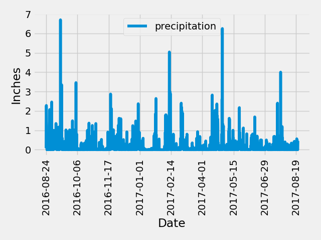
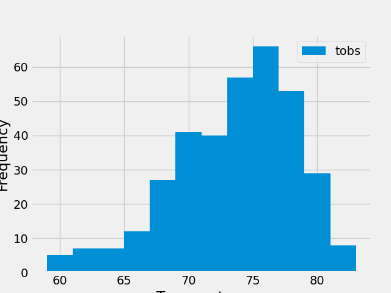

# sqlalchemy-challenge
Module 10 Challenge - SQL Alchemy

## Overview
#
We're planning a vacation to Hawaii! In this project, we performed analyses to learn more about the climate in the area and develop a climate api for sharing this information.

### Precipitation Analysis
- First we found the most recent 12 months of data to perform our analysis.
- Then, we pulled the precipitation data for each date.
- We saved this data into a dataframe and displayed in a plot.
    

### Station Analysis
- We pulled a list of the stations and counted their entries in the database to determine which location was the most active.
- Then we calculated the minimum, maximum, and average temperatures recorded at the most active site.
- We saved the various readings for the most active station into a dataframe and plotted it in a histogram.
    

### Climate API
- Once we had all of the information, we created an API via Flask to share the information in our browser. 
- The available items in this API are:
    - api/v1.0/precipitation
    - api/v1.0/stations
    - api/v1.0/tobs
    - api/v1.0/start-date
    - api/v1.0/start-date/end-date

